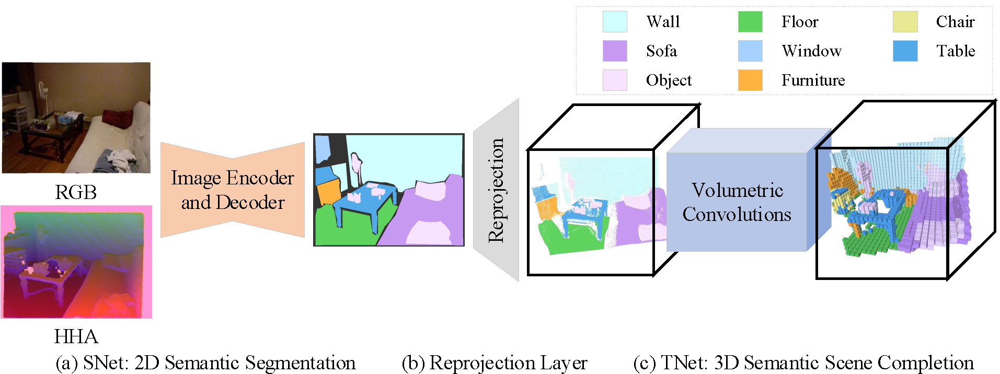

# See and Think: Disentangling Semantic Scene Completion

This repository contains training and testing code for our paper on semantic scene completion, which leverages a disentangled framework to produce more accurate completions. More information about the project can be found in our [paper](https://papers.nips.cc/paper/7310-see-and-think-disentangling-semantic-scene-completion.pdf) and the 3-minute video on the [YouTube](https://youtu.be/YXvniY2U5ml).

If you find SATNet useful in your research, please cite:

	@article{
		
	}

This project mainly consists of two parts, semantic segmentation and semantic scene completion. The semantic segmentation results will accelerate the convergence speed of semantic scene completion. If you want to train either part, you should download the datasets and fix the file path in the 'config.py' and the corresponding '.sh'. If you want to test either part only, you should download the pretrained model.

### Datasets

The datasets, used in the project, are stored in the baiduyun. The URL is .

For convenience, we split the big file into several smaller files by the instruction 'split' in the Ubuntu. Therefore, for these small files, we need to merge them by the instruction 'cat' in the Ubuntu. For example, we need to run the command 'cat myselect_suncg.zip.* > myselect_suncg.zip' to merge them.

### Pretrained Models

The pretrained models are also stored in the baiduyun. The URL is .

### Organization

	Semantic_Segmentation : 
	
		seg_* : the front-end of the certain task.
		engine* : the back-end of the certain task.
		*.sh : the interface of training.
	
	Semantic_Scene_Completion :
	
		NYU :
	
			seg_* : the front-end of the certain task.
			engine* : the back-end of the certain task.
			*.sh : the interface of training.
			gen_result_* : to generate the results of the certain task.
			pretrained_models/ : training on the NYU is based on the pretrained models on the SUNCG.
	
		SUNCG_D :
	
			seg_* : the front-end of the certain task.
			engine* : the back-end of the certain task.
			*.sh : the interface of training.
			gen_result_* : to generate the results of the certain task.
	
		SUNCG_RGBD :
	
			seg_* : the front-end of the certain task.
			engine* : the back-end of the certain task.
			*.sh : the interface of training.
			gen_result_* : to generate the results of the certain task.
			eval_results.py : to evaluate the results with the groundtruth.
			labels/ : the groundtruth.

### License

Code is released under the MIT License (refer to the LICENSE file for details)
